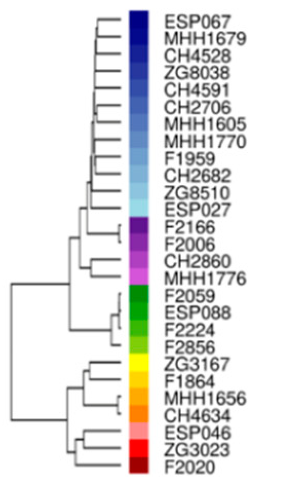
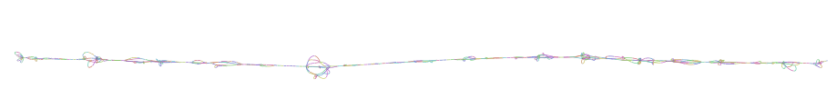
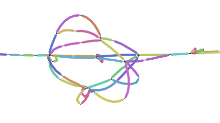
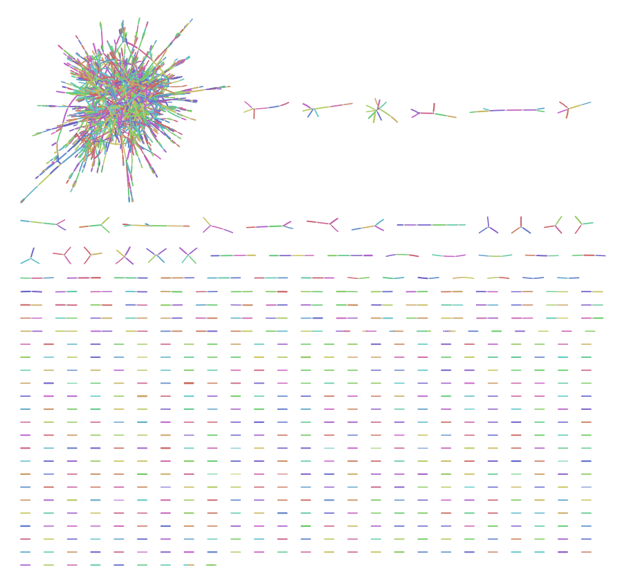
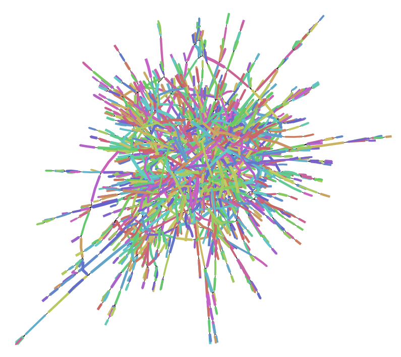

# Testing Pandora with panX data

Pandora needs pangenome graphs as input in order to work. These should be generated with [make_prg](https://github.com/rmcolq/make_prg), and the usage example on [GitHub](https://github.com/rmcolq/pandora) suggests to use multiple sequence alignments (MSA) from [panX](http://pangenome.de/) as input for that. Great, this looks like something Sara would like!

I'm going to [download](http://pangenome.de/#downloads) "core gene alignments" and "all gene alignments" for *Pseudomonas aeruginosa*, of course:

```bash
cd /data3/genome_graphs/
mkdir panX_paeru
cd panX_paeru
wget http://pangenome.de/dataset/Pseudomonas_aeruginosa/core_gene_alignments.tar.gz
wget http://pangenome.de/dataset/Pseudomonas_aeruginosa/all_gene_alignments.tar.gz
```

## Core genes

Well then, make_prg needs an index file of the multiple sequence alignments it's going to combine, so let's have a look at the compressed file I downloaded.

```
tar -xzvf core_gene_alignments.tar.gz
cd core_gene_alignments/
```

The core gene directory contains over 4000 files - nucleotide and amino acid sequences each for the core genes of *P. aeruginosa* as determined by the panX approach.

**Note**: We already know that the nucleotide sequences I'm going to work with for now lack stop codons. We hope that this will change eventually, and it shouldn't be too much of a problem for this test.

Since I don't plan to use the amino acid sequence alignments at all, I'm going to remove those files before I create the index for make_prg.

```bash
rm *aa_aln.fa.gz
mkdir alignments
mv *fa.gz alignments/
cd ..
touch make_index.py
chmod +x make_index.py
./make_index.py core_gene_alignments/alignments core_genes_index.tsv
```

The index now lists 2264 core genes for *P. aeruginosa*.


### Create a fasta-like pangenome graph

Time for a test run!

```bash
nextflow run ../make_prg/make_prg_nexflow.nf --tsv_in core_genes_index.tsv --pipeline_root /data3/genome_graphs/make_prg/
```

```
N E X T F L O W  ~  version 19.07.0
Launching `../make_prg/make_prg_nexflow.nf` [infallible_avogadro] - revision: 386e5f21f7
executor >  local (4530)
[f6/1a5f94] process > make_prg (2258)   [100%] 2265 of 2265 ✔
[91/fa24b9] process > make_fasta (2265) [100%] 2265 of 2265 ✔
Completed at: 02-Oct-2019 11:11:43
Duration    : 9m 45s
CPU hours   : 3.5
Succeeded   : 4'530
```

Cool! Nine minutes and I have a pangenome_PRG.fa file! It looks similar to a fasta file, with headers and sequences, but the sequences also contain numbers which I assume belong to nodes in the graphs. I wonder if there is a way to visualise these graphs? I'll have to ask, since I can't find any information on that online.

Since I have no influence over the file name, I'll move it to the core gene directory, and then I'll have a look at Pandora itself, starting with the indexing of the graphs.

### Indexing the graph(s)

```bash
mv pangenome_PRG.fa core_gene_alignments/
cd ../
singularity shell pandora_pandora.sif
cd panX_paeru/core_gene_alignments/
pandora index pangenome_PRG.fa
```

The indexing ran for around 20 minutes (without Nextflow, there's no nice duration information). It generates lots of status output about sketching the graphs for the MSA files, and generates a 49 MB index file and a directory (kmer_prgs/01/) with [GFA](https://github.com/GFA-spec/GFA-spec) format files for the single graphs. The GFA files are awesome, because now I do have a chance to visualise the graphs, at least one gene at a time! To do that, I will have to install some more tools first, though, and [I will do that later](#vis), focusing on the read mapping first.

### Mapping a single sample

There are two possibilities for read mapping: mapping single samples (Nanopore or Illumina) or mapping several samples to compare the results. Both should return gene/element presence/absence and genotyped VCF results.

I will try with a single sample first, and I've randomly chosen PA14-like isolate CH3797.  
Unfortunately, Pandora doesn't (yet?) work with paired-end data, so I can only use one of the .fastq files with reads.

```bash
pandora map -p pangenome_PRG.fa -r /data3/clinical_isolates_sq/DNA-seq/final_data_all_clinicals/fastq/fastq/CH3797_R1.fastq.gz -o CH3797_R1
```

```
bash: /data3/clinical_isolates_sq/DNA-seq/final_data_all_clinicals/fastq/fastq/CH3797_R1.fastq.gz: No such file or directory
```

Apparently, the reach of the Singularity container is limited in our system, and I can't access the directory with our clinical isolate data, so I have to copy the FASTQ file:

```bash
exit
mkdir sample_data
cp /data3/clinical_isolates_sq/DNA-seq/final_data_all_clinicals/fastq/fastq/CH3797_R1.fastq.gz .
singularity shell pandora_pandora.sif
pandora map -p pangenome_PRG.fa -r ../../sample_data/CH3797_R1.fastq.gz -o CH3797_R1
```

This time it is running:

```
START: Wed Oct  2 12:43:55 2019

Using parameters:
        prgfile         pangenome_PRG.fa
        readfile        ../../sample_data/CH3797_R1.fastq.gz
        outdir  CH3797_R1
        w               14
        k               15
        max_diff        250
        error_rate      0.11
        threads 1
        output_kg       0
        output_vcf      0
        vcf_refs
        output_comparison_paths 0
        output_covgs    0
        output_mapped_read_fa   0
        illumina        0
        clean   0
        bin     0
        max_covg        300
        genotype        0
        snps_only       0
        discover        0
        denovo_kmer_size

        log_level       info

Wed Oct  2 12:43:55 2019 Loading Index and LocalPRGs from file
Wed Oct  2 12:44:02 2019 Constructing pangenome::Graph from read file (this will take a while)
[2019-10-02 12:44:38.751004] [0x00007f15a934cf80] [info]    100000 reads processed...
[2019-10-02 12:45:15.222485] [0x00007f15a934cf80] [info]    200000 reads processed...
[2019-10-02 12:45:50.812470] [0x00007f15a934cf80] [info]    300000 reads processed...
[2019-10-02 12:46:25.622956] [0x00007f15a934cf80] [info]    400000 reads processed...
[2019-10-02 12:47:00.004815] [0x00007f15a934cf80] [info]    500000 reads processed...
[2019-10-02 12:47:33.986348] [0x00007f15a934cf80] [info]    600000 reads processed...
[2019-10-02 12:48:07.537543] [0x00007f15a934cf80] [info]    700000 reads processed...
[2019-10-02 12:48:19.061949] [0x00007f15a934cf80] [info]    Processed 734237 reads
Wed Oct  2 12:48:19 2019 Writing pangenome::Graph to file CH3797_R1/pandora.pangraph.gfa
Wed Oct  2 12:48:19 2019 Update LocalPRGs with hits
Wed Oct  2 12:48:20 2019 Estimate parameters for kmer graph model
[2019-10-02 12:48:20.651002] [0x00007f15a934cf80] [info]    Collect kmer coverage distribution
[2019-10-02 12:48:20.659423] [0x00007f15a934cf80] [info]    Writing kmer coverage distribution to CH3797_R1/kmer_covgs.txt
mean, var: 28.4014 39.1444
0 108 43
[2019-10-02 12:48:20.660916] [0x00007f15a934cf80] [info]    Collect kmer probability distribution
[2019-10-02 12:48:21.563465] [0x00007f15a934cf80] [info]    Writing kmer probability distribution to CH3797_R1/kmer_probs.txt
[2019-10-02 12:48:21.563865] [0x00007f15a934cf80] [info]    Estimated threshold for true kmers is -23
Wed Oct  2 12:48:21 2019 Find PRG paths and write to files:
[2019-10-02 12:48:21.604949] [0x00007f15a934cf80] [info]    4.48029% done
[2019-10-02 12:48:21.645390] [0x00007f15a934cf80] [info]    8.96057% done
[2019-10-02 12:48:21.700361] [0x00007f15a934cf80] [info]    13.4409% done
[2019-10-02 12:48:21.760956] [0x00007f15a934cf80] [info]    17.9211% done
[2019-10-02 12:48:21.824591] [0x00007f15a934cf80] [info]    22.4014% done
[2019-10-02 12:48:21.888793] [0x00007f15a934cf80] [info]    26.8817% done
[2019-10-02 12:48:21.956647] [0x00007f15a934cf80] [info]    31.362% done
[2019-10-02 12:48:22.034170] [0x00007f15a934cf80] [info]    35.8423% done
[2019-10-02 12:48:22.116669] [0x00007f15a934cf80] [info]    40.3226% done
[2019-10-02 12:48:22.194769] [0x00007f15a934cf80] [info]    44.8029% done
[2019-10-02 12:48:22.281234] [0x00007f15a934cf80] [info]    49.2832% done
[2019-10-02 12:48:22.360244] [0x00007f15a934cf80] [info]    53.7634% done
[2019-10-02 12:48:22.454212] [0x00007f15a934cf80] [info]    58.2437% done
[2019-10-02 12:48:22.543343] [0x00007f15a934cf80] [info]    62.724% done
[2019-10-02 12:48:22.656645] [0x00007f15a934cf80] [info]    67.2043% done
[2019-10-02 12:48:22.760805] [0x00007f15a934cf80] [info]    71.6846% done
[2019-10-02 12:48:22.852943] [0x00007f15a934cf80] [info]    76.1649% done
[2019-10-02 12:48:22.958296] [0x00007f15a934cf80] [info]    80.6452% done
[2019-10-02 12:48:23.061969] [0x00007f15a934cf80] [info]    85.1254% done
[2019-10-02 12:48:23.172718] [0x00007f15a934cf80] [info]    89.6057% done
[2019-10-02 12:48:23.275705] [0x00007f15a934cf80] [info]    94.086% done
[2019-10-02 12:48:23.381372] [0x00007f15a934cf80] [info]    98.5663% done
FINISH: Wed Oct  2 12:48:23 2019
```

Five minutes for 2266 core genes, not bad!  
The output directory contains four files: kmer_covg.txt, kmer_probs.txt, pandora.consensus.fq.gz, and pandora.pangraph.gfa. There is no VCF file, which I assume is due to me not having a reference annotation (see [Usage](https://github.com/rmcolq/pandora#usage)).

```
Usage: pandora map -p PanRG_FILE -r READ_FILE -o OUTDIR <option(s)>
  Options:
   -h,--help                        Show this help message
   -p,--prg_file PanRG_FILE         Specify a fasta-style PanRG file
   -r,--read_file READ_FILE         Specify a file of reads in fasta/q format
   -o,--outdir OUTDIR               Specify directory of output
   -w W                             Window size for (w,k)-minimizers, must be <=k, default 14
   -k K                             K-mer size for (w,k)-minimizers, default 15
   -m,--max_diff INT                Maximum distance between consecutive hits within a cluster, default 250 bps
   -e,--error_rate FLOAT            Estimated error rate for reads, default 0.11/0.001 for Nanopore/Illumina
   -c,--min_cluster_size INT        Minimum number of hits in a cluster to consider a locus present, default 10
   --genome_size NUM_BP             Estimated length of genome, used for coverage estimation, default 5000000
   --vcf_refs REF_FASTA             A fasta file with an entry for each loci in the PanRG in order, giving 
                                    reference sequence to be used as VCF ref. Must have a perfect match to a 
                                    path in the graph and the same name as the locus in the graph.
   --illumina                       Data is from Illumina, not Nanopore, so is shorter with low error rate
   --bin                            Use binomial model for kmer coverages, default is negative binomial
   --max_covg INT                   Maximum average coverage from reads to accept, default first 300
   --genotype                       Output a genotyped VCF
   --discover                       Add denovo discovery
   --denovo_kmer_size INT           Kmer size to use for denovo discovery, default 11
   --log_level LEVEL                Verbosity for logging, use "debug" for more output
```

I don't have a fasta reference for the core genes downloaded from panX, so I can't generate VCFs - that makes sense. Let's play with the other options, though!

```bash
pandora map -p pangenome_PRG.fa -r ../../sample_data/CH3797_R1.fastq.gz -o CH3797_R1_discover --illumina --discover
```

```
START: Wed Oct  2 13:17:30 2019

Using parameters:
        prgfile         pangenome_PRG.fa
        readfile        ../../sample_data/CH3797_R1.fastq.gz
        outdir  CH3797_R1_discover
        w               14
        k               15
        max_diff        31
        error_rate      0.001
        threads 1
        output_kg       0
        output_vcf      0
        vcf_refs
        output_comparison_paths 0
        output_covgs    0
        output_mapped_read_fa   0
        illumina        1
        clean   0
        bin     0
        max_covg        300
        genotype        0
        snps_only       0
        discover        1
        denovo_kmer_size

        log_level       info


FINISH: Wed Oct  2 13:44:20 2019
```

I'm only copying start time, parameters, and end time to here now, to save space.

This took almost half an hour to run, and created the same files as before, plus a directory with de novo paths. This directory contains 2550 fasta files, with mostly one entry per file, and the file names are the gene IDs from before, together with additional numbers which I expect to be location ranges.

Sooner or later I will need help interpreting these results...

I had a chat with Zamin, but without my data at hand. He says there should be a matrix file with gene presence and absence, but all I have are the coverage and the probability files, which I am quite sure are something else. Maybe this also only works with multiple samples?


### Comparing several samples

To make the comparison of multiple samples interesting, I decided to work with the 27 isolates from Jelena and Janne's [new paper](https://doi.org/10.3390/cells8101129). That means I also have a genetic distance tree based on 1021 genes of which proteins could be quantified at my disposal as well:

  
*Hierarchical clustering by genetic distance based on the 1021 genes for which the encoded proteins were quantified in this study. PAO1-like strains predominate and are colored in blue-, violet-, and green colors, respectively. PA14-like strains are colored in yellow/orange or red (Erdmann et al., 2019).*

To use these isolates, I copied the FASTQ files with the first reads in the pairs to the same sample_data directory where the other single FASTQ file was already located. Then I created a read index with sample ID and FASTQ file name (tab separated) per line as per the Pandora instructions. Now I can start the mapping:

```bash
singularity shell pandora_pandora.sif
cd panX_paeru/core_gene_alignments/
pandora compare -p pangenome_PRG.fa -r ../../sample_data/27_isolates.tsv -o 27_isolates --illumina
```

```
START: Fri Oct 11 12:03:57 2019

Using parameters:
        prgfile         pangenome_PRG.fa
        read_index_fpath        ../../sample_data/27_isolates.tsv
        outdir  27_isolates
        w               14
        k               15
        max_diff        31
        error_rate      0.001
        threads 1
        vcf_refs
        illumina        1
        clean   0
        bin     0

        max_covg        300
        genotype        0
        log_level       info

Fri Oct 11 12:03:57 2019 Loading Index and LocalPRGs from file
Fri Oct 11 12:04:09 2019 Loading read index file ../../sample_data/27_isolates.tsv
Fri Oct 11 12:04:09 2019 Finished loading 26 samples from read index
[2019-10-11 12:04:09.913091] [0x00007f53d5581f80] [info]    Constructing pangenome::Graph from read file CH2682_S11_L001_R1_001.fastq.gz (this will take a while)
Unable to open fastaq file CH2682_S11_L001_R1_001.fastq.gz
```

OK, so does `pandora compare` not like compressed files?

```bash
cd ../../sample_data/
gunzip CH2682_S11_L001_R1_001.fastq.gz
cd ../panX_paeru/core_gene_alignments
pandora compare -p pangenome_PRG.fa -r ../../sample_data/27_isolates.tsv -o 27_isolates --illumina
```

```
START: Fri Oct 11 12:09:17 2019

Using parameters:
        prgfile         pangenome_PRG.fa
        read_index_fpath        ../../sample_data/27_isolates.tsv
        outdir  27_isolates
        w               14
        k               15
        max_diff        31
        error_rate      0.001
        threads 1
        vcf_refs
        illumina        1
        clean   0
        bin     0

        max_covg        300
        genotype        0
        log_level       info

Fri Oct 11 12:09:17 2019 Loading Index and LocalPRGs from file
Fri Oct 11 12:09:24 2019 Loading read index file ../../sample_data/27_isolates.tsv
Fri Oct 11 12:09:24 2019 Finished loading 26 samples from read index
[2019-10-11 12:09:24.568988] [0x00007ffb6d2bbf80] [info]    Constructing pangenome::Graph from read file CH2682_S11_L001_R1_001.fastq (this will take a while)
Unable to open fastaq file CH2682_S11_L001_R1_001.fastq
```

No, that doesn't seem to be the problem. Maybe it would make sense to include the file path in the index file as well...

```bash
pandora compare -p pangenome_PRG.fa -r ../../sample_data/27_isolates.tsv -o 27_isolates --illumina
```

```
START: Mon Oct 14 08:58:12 2019

Using parameters:
        prgfile         pangenome_PRG.fa
        read_index_fpath        ../../sample_data/27_isolates.tsv
        outdir  27_isolates
        w               14
        k               15
        max_diff        31
        error_rate      0.001
        threads 1
        vcf_refs
        illumina        1
        clean   0
        bin     0

        max_covg        300
        genotype        0
        log_level       info
```

I accidentally closed the console before I could copy the final output, but I remember that the run was done some time around 14:00 server time, so it took between five and six hours.

After mapping all the samples to the pangenome graph, Pandora does a variant calling, putting out the VCF header for each gene in the pangenome to the console, but also saving the files in a VCFs/01/ directory. The files contain information for all the isolates per SNP: genotype, mean forward/reverse coverage, median forward/reverse coverage, summed forward/reversed coverage and number of gaps.

If there was also output for anything else, I sadly missed it when I closed the console.

The output directory now contains subdirectories for all clinical isolates with the same output data I got from mapping a single sample: *kmer_covgs.txt*, *kmer_probs.txt*, *pandora.consensus.fq.gz*, and *pandora.pangraph.gfa*. The directory also contains three other files: *pandora_multisample_consensus.vcf*, *pandora_multisample.matrix*, *pandora_multisample.vcf_ref.fa*, and the subdirectory for the single VCF files (with 2266 files, one for each core gene).

Let's start with the *pandora_multisample* files. The VCF reference is a multifasta file with one sequence per gene graph. I assume this is some kind of consensus sequence file, but I don't know for sure.  
The matrix file lists all the genes and then, in a tab separated table, states in which samples the gene is present (assuming "1" means presence and "0" means absence). From a short glimpse I would say that most core genes are - as expected - present in all of the 27 clinical isolates I tested.  
Finally, there is a consensus VCF file. I assume this lists variations away from the consensus sequences in the VCF reference file. This is huge, as it contains variants for all genes in all isolates, in the same format as the single VCF files.

#### VCF file format

So what exactly do the VCF files look like? I'm choosing a random entry from the big consensus file:

```
#CHROM  POS     ID      REF     ALT     QUAL    FILTER  INFO    FORMAT  CH2682  CH2706  CH2860  CH4528  CH4591  CH4634  ESP027     ESP046  ESP067  ESP088  F1864   F1959   F2006   F2059   F2166   F2224   F2856   MHH1605 MHH1656 MHH1679 MHH1770 MHH1776    ZG3023  ZG3167  ZG8038  ZG8510
GC00000932_14   120     .       G       C       .       .       SVTYPE=SNP;GRAPHTYPE=SIMPLE     GT:MEAN_FWD_COVG:MEAN_REV_COVG:MED_FWD_COVG:MED_REV_COVG:SUM_FWD_COVG:SUM_REV_COVG:GAPS    0:10,4:11,5:14,0:15,0:42,14:46,15:0.25,0.666667 0:19,8:22,10:25,0:29,0:79,26:89,31:0.25,0.666667   0:13,6:20,9:18,0:27,0:55,19:82,27:0.25,0.666667 0:6,2:3,2:8,0:2,0:25,8:13,6:0,0.666667     0:10,4:10,5:14,0:14,0:43,14:43,15:0.25,0.666667 0:11,5:10,4:14,0:12,0:45,16:40,12:0.25,0.666667 0:31,13:22,10:39,0:30,0:124,39:91,30:0.25,0.666667 0:23,11:33,14:29,0:43,0:93,33:133,43:0,0.666667 0:13,5:15,6:17,0:20,0:54,16:63,20:0.25,0.666667    0:19,8:17,8:25,0:23,0:76,25:70,24:0.25,0.666667 1:14,59:19,77:0,59:0,77:59,177:79,233:0.75,0    0:38,17:38,18:49,0:50,0:153,51:155,54:0,0.666667   0:16,7:14,7:22,0:17,0:67,22:57,22:0.25,0.666667 0:19,9:20,9:25,0:27,0:78,27:83,28:0.25,0.666667    0:25,12:30,12:32,0:39,0:101,36:123,38:0,0.666667        0:13,5:19,8:17,0:25,0:54,17:78,25:0.25,0.666667 0:13,5:20,9:17,0:27,0:53,17:82,28:0.25,0.666667    0:14,6:17,8:19,0:21,0:59,20:68,24:0.25,0.666667 0:11,5:9,4:13,0:12,0:44,16:36,12:0.25,0.666667     0:24,10:27,12:31,0:36,0:96,32:110,37:0.25,0.666667      0:15,7:19,8:19,0:25,0:61,22:76,25:0.25,0.666667 0:17,7:23,10:23,0:31,0:69,23:93,31:0.25,0.666667   0:9,4:7,3:12,0:9,0:37,13:29,9:0.25,0.666667     0:16,8:32,14:21,0:41,0:67,24:129,43:0.25,0.666667  0:36,15:37,16:48,0:49,0:146,47:150,50:0.25,0.666667     0:36,14:26,13:45,0:34,0:144,44:107,39:0,0.666667
```

The "chromosome" is here the gene, and the position should be measured from the start codon (or wherever the original multiple sequence alignment started). ID, quality and filter are not given ("."), but reference and alternative variant are shown as "G" and "C", so we have a single nucleotide variant. This is also acknowledged in the "info" column: variant type is SNP and graph type is simple (there is also "nested").  
The next column explains the format of the following sample-wise columns: the values for genotype, mean forward/reverse coverage, median forward/reverse coverage, summed forward/reversed coverage and number of gaps are each separated by colons. The isolates at the end are sorted alphabetically. The GT (genotype) field contains a 0 for all but one isolate, meaning only this one isolates contains the alternative variant according to the [VCF documentation](https://samtools.github.io/hts-specs/VCFv4.2.pdf).

Looking at two example isolates, I think the values can be interpreted the following way:

isolate | GT | MEAN_FWD_COVG | MEAN_REV_COVG | MED_FWD_COVG | MED_REV_COVG | SUM_FWD_COVG | SUM_REV_COVG | GAPS
--------|----|---------------|---------------|--------------|--------------|--------------------|--------------|-----
CH2682  | 0  | 10,4          | 11,5          | 14,0         | 15,0         | 42,14              | 46,15        | 0.25,0.666667
F1864   | 1  | 14,59         | 19,77         | 0,59         | 0,77         | 59,177              | 79,233       | 0.75,0

Isolate CH2682 has the wildtype genotype, but does show a little coverage of the alternative allele (e.g. forward coverage 42 reads for the wildtype, 14 for the alternative, and 46 and 15 on the reverse strand). F1864 on the other hand has a strong preference for the alternative allele (59 to 177 forward and 79 to 233 reverse reads). Is it common to have almost equal forward and reverse coverage?

### Core SNP tree


## Visualising graphs<a name="vis"></a>

### Core genes

#### Single genes in Bandage

[Bandage](http://rrwick.github.io/Bandage/), a nice graph visualisation tool, has executables also for Windows, so I'm using this to visualise single gene graphs while the mapping is running.

I randomly took the first graph file - GC00000001_11_na_aln.fa.k15.w14.gfa - to download it to my PC and loaded it into Bandage. The graph inside is very loopy for a single gene - I think I have to compare this to the multiple sequence alignment.





```bash
cd /data3/genome_graphs/panX_paeru/core_gene_alignments
gunzip GC00000001_11_na_aln.fa.gz
```

I opened the fasta in [UGENE](http://ugene.net/) as a multiple sequence alignment and the sequences look pretty similar to me. They don't all have the same length, but otherwise...


I think I will have to install [odgi](https://github.com/vgteam/odgi) or get vg to work to see sequence details and figure out where the loops come from. Repetitions are difficult to see in the alignment.

#### Core gene mapping results in Bandage

The graph that is created by mapping reads to the pangenome (with the standard settings) is not too big, so I think I can download and visualise that as well.





It looks like some of the core genes were combined, either to that huge mess or to smaller, more or less linear, groups. But this is a mapping result, so I'm not sure how one would interpret this.  
Clicking on nodes in Bandage returns some more details: apparently all of them are only 1 bp long, but their IDs look like those of the core genes I used when creating the "pangenome".

*****

## Questions for Zamin

- Where can I find gene presence/absence information?
- Suggestion for fasta reference for VCF creation when using panX data?
- What are the graphs created after mapping?
- Why are single gene graphs so loopy?
- What does the de novo discovery do, exactly?

## And answers

- The numbers in the PRG file are separators of different parts of the graph.
- The reason why single graphs after indexing are so loopy is Bandage itself, which has no other possibility of visualising the graphs.
- Gene presence and absence should be found in the matrix file.
- A reference for variant calling is not needed. It happens automatically when using `pandora compare`.
- The de novo discovery can be used to complement the graph.

## More questions

- What are the sequences in pandora_multisample.vcf_ref.fa?
- What is the GAPS value in the VCF files?
- What does it mean when a variant has almost equal forward and reverse coverage?
- Why don't we get the same output when mapping single or multiple samples?